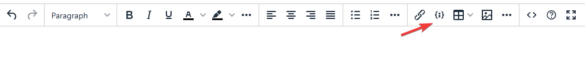
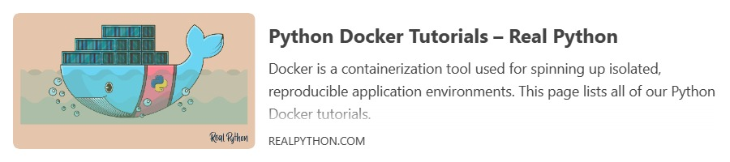
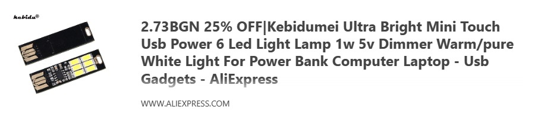
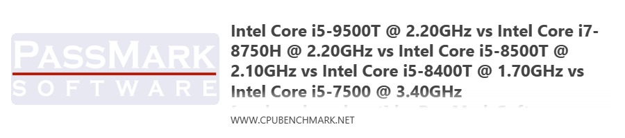
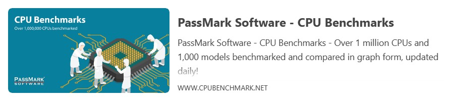
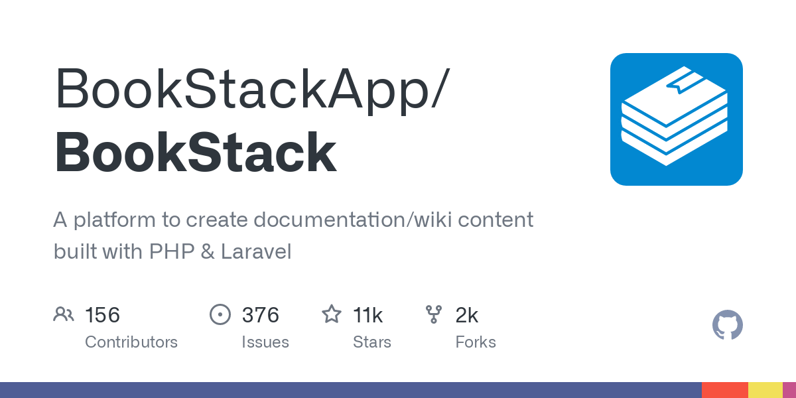
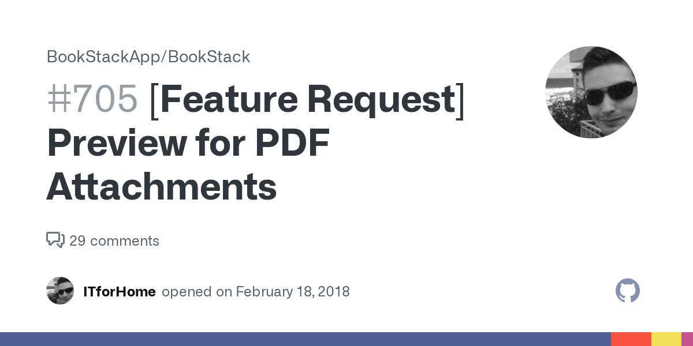
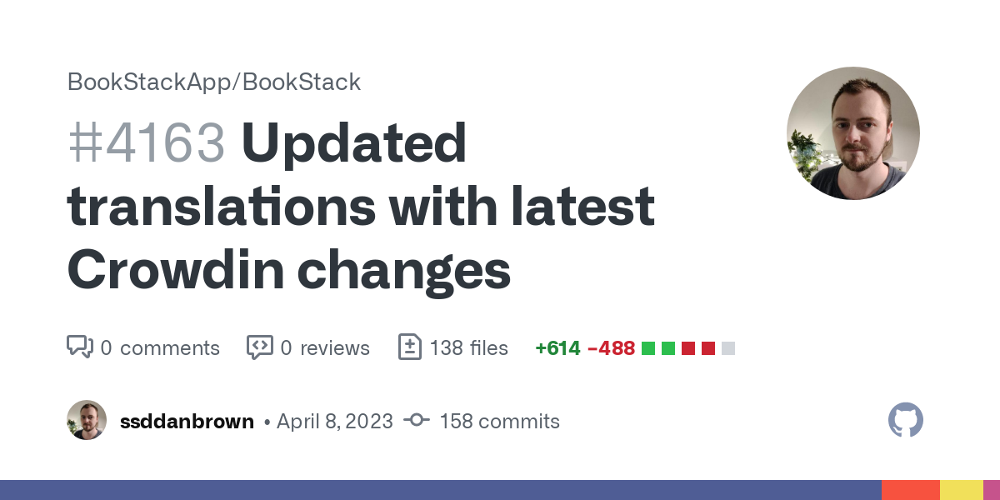
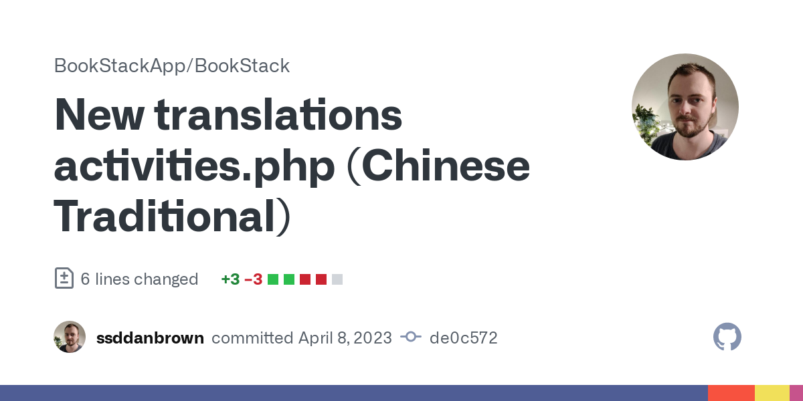

# Rich Media Embeds Addon for Bookstack

[The full explanation and more examples can be found here](https://tenekev.art/posts/introducing-rich-media-embeds-addon-for-bookstack/)

## 📦 How to install Rich Media Embeds addon

RME is designed to run entirely client-side but this comes with its limitations. [If you want to understand why, read the article](https://tenekev.art/posts/introducing-rich-media-embeds-addon-for-bookstack/). The setup process is two-part.

### 1. Setting up[ CORS-Anywhere](https://github.com/Rob--W/cors-anywhere) service:

CORS-A is a lightweight service that even has public instances. It's advised to set up your own without the limitations or risks of public ones. My Bookstack is containerized, thus I'm showing a containerized version of CORS-A too. We will be using [this well-known image](https://hub.docker.com/r/testcab/cors-anywhere) of CORS-A in a snipped of a docker-compose file.

```yaml
version: '3.4'

services:
  cors-anywhere:
    image: testcab/cors-anywhere
    container_name: cors-anywhere
    ports:
      - 8080:8080
    restart: unless-stopped
```

It's tempting to put both containers on the same docker network and try to use `<a href="http://cors-anywhere:8080">http://cors-anywhere:8080</a>` but it will not work. We are running client-side! While the services will see each other, the clients (our browsers) are not part of this network. At the very least, you need to use the docker host ip or hostname like so - `<a href="http://cors-anywhere:8080">http://dockerhost:8080</a>`

⚠️ If your Bookstack instance is running on HTTPS, so must CORS-A. Your browser won't allow you to serve insecure HTTP requests on a secured HTTPS page!

### 2. Injecting RME addon into Bookstack

Bookstack conveniently allows for the injection of custom code in the `<head>` element of the site. **Settings &gt; Customization &gt; Custom HTML Head Content**.

**The simplest approach** is to just copy the contents of addon-rich-media-embeds.js, html2canvas.min.js and styles.css in respective `<script>` and `<style>` tags. 
[Here is the code.](head-simple.html)
However, it introduces a lot of lines of code that is hard to manage.

**The better approach** is to link these files from your filesystem. Here is how to place them in Bookstack's `/config/www/uploads/` directory. This will serve them with the rest of Bookstack's files.

```yaml
version: '3.4'

services: 
  bookstack:
    image: lscr.io/linuxserver/bookstack:latest
    ...
    volumes:
      - ${DIR_CONFIG}/bookstack/config:/config
      # Custom files
      - ${DIR_CONFIG}/bookstack/html2canvas.min.js:/config/www/uploads/html2canvas.min.js
      - ${DIR_CONFIG}/bookstack/addon-rich-media-embeds.js:/config/www/uploads/addon-rich-media-embeds.js
      - ${DIR_CONFIG}/bookstack/styles.css:/config/www/uploads/styles.css
```

Here is how the **Custom HTML Head Content** will look:

```html
<!-- RME Config -->
  <script>
    const proxy_server = 'https://cors.yourdomain.tld/'  // <- Note the trailing slash /
    const remove_tempCard = true;
  </script>

<!-- Link html2canvas from CDN or from file -->
  <script src="https://cdn.jsdelivr.net/npm/html2canvas@1.4.1/dist/html2canvas.min.js"></script>
<!-- OR  -->
  <script src="https://bookstack.yourdomain.tld/uploads/html2canvas.min.js"></script>

<!-- Link RME's JS and CSS -->
  <script src="https://bookstack.yourdomain.tld/uploads/addon-rich-media-embeds.js"></script>
  <link href="https://bookstack.yourdomain.tld/uploads/styles.css" rel="stylesheet"/>
```

⚠️ Regardless of your methodology, make sure to change the `proxy_server` variable on line #3 to your CORS-Anywhere instance's address.

Once you open the editor, you should see this in your toolbar:

[](images/image.png)You are ready to start posting links for beautiful embeds.

## ⛓️ Dependencies

- Bookstack (obviously)
- [TinyMCE](https://www.tiny.cloud/) - The Bookstack WYSIWYG editor
- [CORS-Anywhere Docker image by testcab](https://github.com/testcab/docker-cors-anywhere)
- [html2canvas project by niklasvh](https://github.com/niklasvh/html2canvas)

## Examples of RME cards from different sites

Notes in **BOLD** with *Lorem ipsum* as filler.

*Et et aliquip delenit aliquam nulla. Iriure nulla amet ut. Gubergren accusam no molestie dolore sed. Kasd suscipit ea eirmod consetetur kasd nisl aliquyam magna sadipscing et dolor et sadipscing sea. Stet dolor lorem accusam clita erat sit sed commodo amet labore est ut velit rebum dolore facilisis. Sed no luptatum consequat et eos et nihil dolor et consetetur dolore sit labore ipsum.*

#### A blog  

[](https://realpython.com/tutorials/docker/)

*Diam vel takimata exerci lorem dolore sit at exerci ipsum lorem delenit consetetur dolor sed amet. Ipsum ipsum amet. Gubergren sea in est eu dolore at illum dolores aliquyam. Ipsum iriure est dolore at dolores ut molestie eum takimata sit vero labore. Ea no elitr sed sanctus vel aliquyam consequat tation est et esse nisl molestie. Dolore nam elitr molestie elit gubergren amet nonumy.*

#### An AliExpress Item
[](https://www.aliexpress.com/item/32373860543.html?spm=a2g0o.cart.0.0.71b938daTui1cG&mp=1)


#### Some random website

**It lacks OG: data so the biggest image is used instead.**

*Stet rebum est ipsum aliquyam nisl duis sanctus ipsum ipsum duo sit et justo voluptua amet aliquyam consetetur. Vero consectetuer stet ut justo et dolore invidunt aliquyam. Ipsum ipsum aliquyam aliquip dolore cum.*

[](https://www.cpubenchmark.net/compare/3454vs3237vs3231vs3260vs2910/Intel-i5-9500T-vs-Intel-i5-8500T-vs-Intel-i5-8400T-vs-Intel-i5-7500-vs-Intel-i7-8750H/img/PassMarkLogo.png)

*Diam vel takimata exerci lorem dolore sit at exerci ipsum lorem delenit consetetur dolor sed amet. Ipsum ipsum amet. Gubergren sea in est eu dolore at illum dolores aliquyam. Ipsum iriure est dolore at dolores ut molestie eum takimata sit vero labore. Ea no elitr sed sanctus vel aliquyam consequat tation est et esse nisl molestie. Dolore nam elitr molestie elit gubergren amet nonumy.*

**Same site but this page has a bigger image.**

#### [](https://www.cpubenchmark.net/)

#### YouTube video

*Accusam magna dolor sed diam tempor et takimata vero eu quod iusto ea dolore sed et dolores duo. Labore dolore dolore ex dolor et iriure no eros diam in justo at diam sit et sit te dolore.*

### [](https://www.youtube.com/watch?v=7hn4Ttfq8y0)

*Sed et invidunt qui elitr sit clita amet ipsum. Zzril eos amet eu feugiat diam nonumy et dolore dolor. No vulputate amet magna consequat ut sed duo sadipscing ipsum euismod. Diam vulputate at kasd augue duo duo clita consectetuer lorem et.*

#### GitHub Cards

*Dolore at in diam. Aliquyam imperdiet justo nonummy diam vero vel vulputate vero sed sed ipsum erat. Et lorem eos no takimata sit amet dolor sadipscing at vero ut amet. Amet invidunt stet lorem kasd est eum ea ullamcorper vero gubergren ipsum tincidunt takimata aliquyam takimata illum sit.*

---

#### Repos

[](https://github.com/BookStackApp/BookStack)

*Lorem eum amet labore ea. Erat sanctus magna nonumy nibh sadipscing vulputate takimata placerat elitr consetetur nibh justo elitr eleifend erat. Aliquyam amet erat minim hendrerit nam rebum ipsum elitr soluta ut dolor magna dolore. Consequat quis est kasd magna.*

---

#### Issues

[](https://github.com/BookStackApp/BookStack/issues/705#issuecomment-1203691993)

*Accusam eum et tempor nulla kasd. Et consequat et diam no feugiat takimata congue stet et dolore nonumy eirmod tempor. Eirmod et duis labore eos amet at magna. Eu nulla iusto aliquyam suscipit nulla dolor eirmod eu sed zzril sit labore facilisis diam id euismod sea.*

---

#### Pull Requests

[](https://github.com/BookStackApp/BookStack/pull/4163)

*Nonumy sadipscing possim sit et dolores vero wisi. Sanctus magna ex nam et exerci voluptua kasd. Delenit laoreet erat eos consequat sea dolore. Ut accumsan ipsum accusam. Consetetur magna erat est erat gubergren consetetur sed.*

---

#### Commits

[](https://github.com/BookStackApp/BookStack/pull/4163/commits/de0c572785eb34453625daaf8982172e14f50777)

*Tempor kasd aliquyam est iriure sit justo lorem tempor in. Autem invidunt sit consequat soluta stet eos ipsum zzril dolor sed sadipscing at sit voluptua elitr consetetur possim commodo. Takimata duo vero lorem praesent no illum nisl no sed illum autem justo sed.*